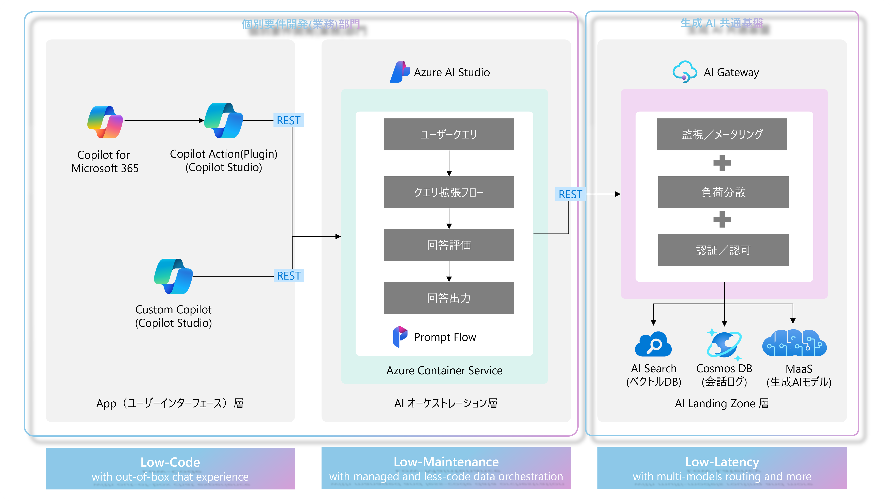
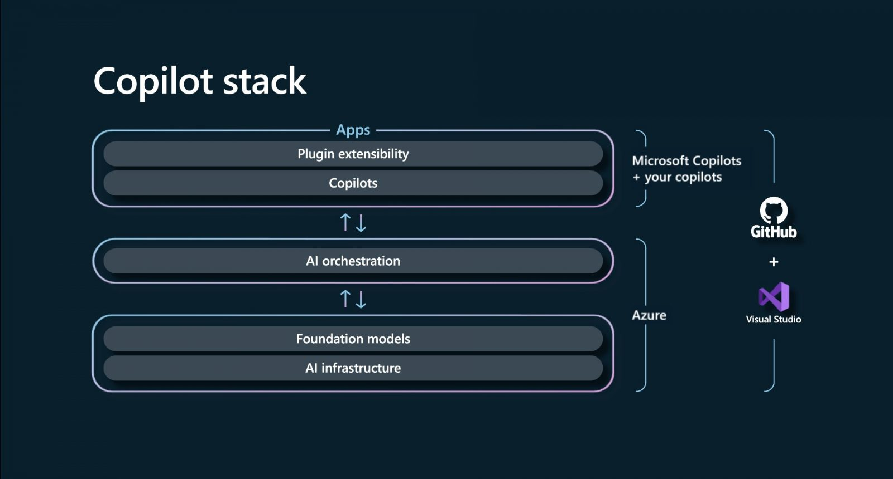

# 3 Lower Architecture for GenAI workloads
## 1. 概要
組織内では日々新たなインテリジェントアプリケーション（生成 AI を活用した社内情報検索、提案アプリ等）が開発されています。
 
生成 AI アプリケーションワークロード開発に必要なツールセットやスキルセット、アプローチにはダイナミック性、迅速性が求められる為、”一度開発して終わり”や”システムの塩漬け”という考え方が通用しません。
 
本アーキテクチャーは以下をペルソナ、課題とした上で組織が効率よく迅速にインテリジェントアプリケーションワークロードを展開可能となる事を目標とします。

- **ペルソナ**

  ▶これから新規インテリジェントアプリケーションを開発するプロジェクトリーダー、ビジネスリーダーの方

  ▶既に開発したインテリジェントアプリケーションワークロードの汎用化、テンプレート化を目指されるプロジェクトリーダー、ビジネスリーダーの方

  ▶組織内で複数のインテリジェントアプリケーション開発要望があるにも関わらず、正しいアプローチの模索に時間を要し最初の一手が打てていないプロジェクトリーダー、ビジネスリーダーの方
    

- **ターゲットとなる課題**
  
  ▶フロントレイヤー（ユーザーインターフェース）
    
    ・複数のサンプルはインターネット上にあるものの、自組織に適用させるカスタマイゼーションが困難

    ・インターネット上のサンプルを元に組織内展開したものの、利用されているライブラリ、フレームワーク等のバージョン追随が組織内構成的に難しくセキュリティ脆弱性に懸念がある
      

  ▶ミドルレイヤー（データオーケストレーション）

    ・複数のサンプルはインターネット上にあるものの、自組織に適用させるカスタマイゼーションが困難

    ・インターネット上のサンプルを元に組織内展開したものの、利用されているライブラリ、フレームワーク等のバージョン追随が組織内構成的に難しくセキュリティ脆弱性に懸念がある

    ・利用者が増加した際のスケーリングが容易ではなく、クラウドコンピューティングの知識に乏しい為、恒久運用が難しい
      

  ▶バックエンドレイヤー（生成 AI モデル／データストア）
    
    ・一元化されたポリシー設定によりセキュリティ性を担保し、組織内横断的に生成 AI モデルを利用させたいが方法が分からない

    ・生成 AI モデルのトークン制限によりクライアントアプリケーションでエラーが頻発する
      

上記課題を解決する為、各レイヤーに適用するアプローチ設計が非常に重要です。本アーキテクチャーでは上記課題に対してローコード／レスコードアプローチによる運用、メンテナンス性の向上、並びに生成 AI ワークロードに特化したゲートウェイを共通基盤として提供する事によるクライアントアプリケーションへのエラー／遅延を低減させる事を目的とします。

## 2. 3-Lower Architecture

上記アーキテクチャーは [Copilot Stack](https://news.microsoft.com/ja-jp/features/230524-microsoft-outlines-framework-for-building-ai-apps-and-copilots-expands-ai-plugin-ecosystem/)をベースに構成されています。

## 3. アーキテクチャーのポイント／サンプル
各レイヤーで利用可能なサンプルと目的を以下にまとめます。

|  |  |  |
| -- | -- | -- |
| レイヤー | サンプル | 目的 |
| App(ユーザーインターフェース)層 | [POC-CopilotStudio-Tips](https://github.com/TK3214-MS/POC-CopilotStudio-Tips) | Out of box で利用可能なチャットインターフェースを提供する [Copilot Studio](https://www.microsoft.com/ja-jp/microsoft-copilot/microsoft-copilot-studio) を利用し、フロントエンド開発レイバーを低減します。 |
| AI オーケストレーション層 | [POC-PromptFlow-AdvancedRAG](https://github.com/TK3214-MS/POC-PromptFlow-AdvancedRAG) | [Prompt Flow](https://learn.microsoft.com/ja-jp/azure/ai-studio/how-to/prompt-flow) を用いて組織内ドキュメントへのアクセス、生成 AI モデルへのアクセス等をレスコードで定義し、クエリ拡張や HyDE 等の Advanced RAG アプローチを構成し、メンテナンス性を向上します。 |
| AI Landing Zone(データ)層 | [POC-DocumentOrchestration](https://github.com/TK3214-MS/POC-DocumentOrchestration) | [Document Intelligence](https://learn.microsoft.com/ja-jp/azure/ai-services/document-intelligence/overview?view=doc-intel-4.0.0) を用いたドキュメントインデックス手法をプロ＋ローコードアプローチで実行する事でメンテナンス範囲を限定的にします。 |
| AI Landing Zone(データ)層 | [POC-AI-Gateway](https://github.com/TK3214-MS/POC-AI-Gateway) | モデル間の負荷分散やトークン、コストの可視化等の生成 AI アプリケーションワークロードに特化した機能を有効化した [API Management](https://azure.microsoft.com/ja-jp/products/api-management) を用いて組織内全てのインテリジェントアプリケーションからの要求を処理する生成 AI 共通基盤を設ける事により組織内の開発プリンシパル統一、クライアントアプリケーションの信頼性を向上します。 |
|  |  |  |