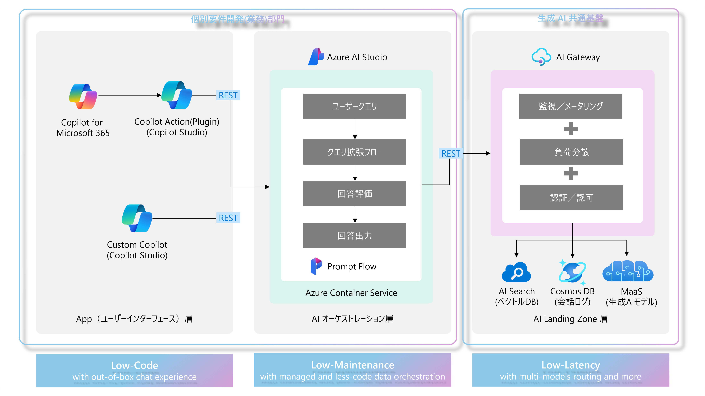
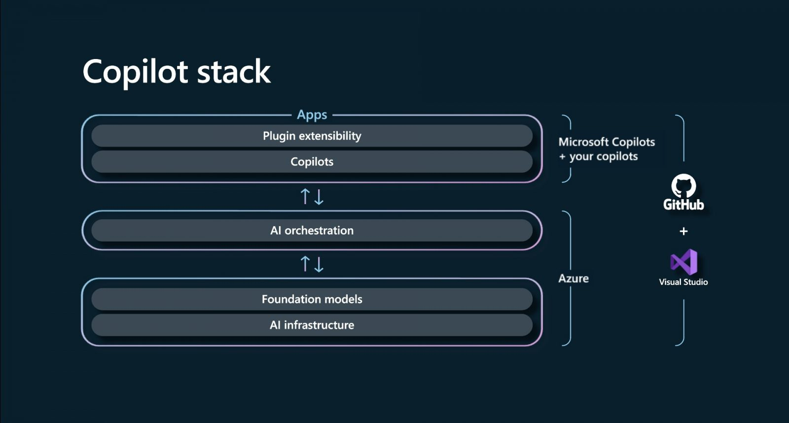

# 3 Lower Architecture for GenAI Workloads

## 1. Overview
Within the organization, new intelligent applications (such as internal information search and proposal apps using generative AI) are being developed daily. The toolsets, skillsets, and approaches required for developing generative AI application workloads demand dynamism and speed, making the "develop once and done" or "system shelving" mindset obsolete.

This architecture aims to enable the organization to efficiently and swiftly deploy intelligent application workloads by addressing the following personas and challenges:

- **Personas**
  - Project leaders and business leaders who are about to develop new intelligent applications.
  - Project leaders and business leaders aiming to generalize and template already developed intelligent application workloads.
  - Project leaders and business leaders who have multiple intelligent application development requests within the organization but are struggling to find the right approach and have not yet taken the first step.

- **Target Challenges**
  - **Front Layer (User Interface)**
    - Although there are multiple samples available on the internet, customizing them for the organization is difficult.
    - Even if deployed within the organization based on internet samples, keeping up with the versions of libraries and frameworks used is structurally challenging, raising security concerns.

  - **Middle Layer (Data Orchestration)**
    - Although there are multiple samples available on the internet, customizing them for the organization is difficult.
    - Even if deployed within the organization based on internet samples, keeping up with the versions of libraries and frameworks used is structurally challenging, raising security concerns.
    - Scaling when the number of users increases is not easy, and due to a lack of cloud computing knowledge, permanent operation is difficult.

  - **Back-End Layer (Generative AI Model/Data Store)**
    - Ensuring security through centralized policy settings and enabling cross-organizational use of generative AI models is desired, but the method is unknown.
    - Frequent errors occur in client applications due to token limitations of the generative AI model.

To solve the above challenges, it is crucial to design approaches applicable to each layer. This architecture aims to improve operational and maintenance efficiency through low-code/no-code approaches and to reduce errors/delays in client applications by providing a common platform specialized for generative AI workloads.

## 2. 3-Lower Architecture

Above architecture is built upon [Copilot Stack](https://news.microsoft.com/ja-jp/features/230524-microsoft-outlines-framework-for-building-ai-apps-and-copilots-expands-ai-plugin-ecosystem/).

## 3. Architecture Points/Samples
Below are the samples and purposes available for each layer:

| Layer | Sample | Purpose |
| -- | -- | -- |
| App (User Interface) Layer | [POC-CopilotStudio-Tips](https://github.com/TK3214-MS/POC-CopilotStudio-Tips) | Utilize [Copilot Studio](https://www.microsoft.com/ja-jp/microsoft-copilot/microsoft-copilot-studio) to provide an out-of-the-box chat interface, reducing frontend development labor. |
| AI Orchestration Layer | [POC-PromptFlow-AdvancedRAG](https://github.com/TK3214-MS/POC-PromptFlow-AdvancedRAG) | Define access to internal documents and generative AI models with low-code using [Prompt Flow](https://learn.microsoft.com/ja-jp/azure/ai-studio/how-to/prompt-flow), configuring advanced RAG approaches like query expansion and HyDE to improve maintainability. |
| AI Landing Zone (Data) Layer | [POC-DocumentOrchestration](https://github.com/TK3214-MS/POC-DocumentOrchestration) | Execute document indexing methods using [Document Intelligence](https://learn.microsoft.com/ja-jp/azure/ai-services/document-intelligence/overview?view=doc-intel-4.0.0) with a pro/low-code approach to limit the maintenance scope. |
| AI Landing Zone (Data) Layer | [POC-AI-Gateway](https://github.com/TK3214-MS/POC-AI-Gateway) | Establish a common generative AI platform to handle requests from all intelligent applications within the organization using [API Management](https://azure.microsoft.com/ja-jp/products/api-management), enabling load balancing between models, token and cost visualization, and improving client application reliability. |
|  |  |  |